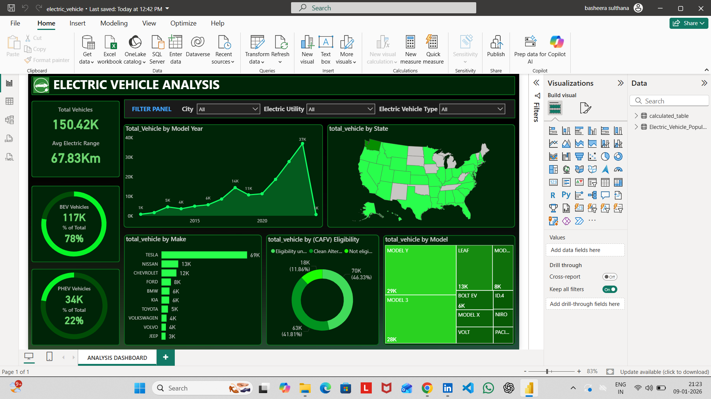

# Electric Vehicle Data Analysis 🚗⚡

## 📌 Project Overview
This project analyzes Electric Vehicle data using Power BI.  
The dashboard provides insights into:

- EV growth trends
- State-wise registrations
- Vehicle type distribution
- Manufacturer analysis
- Year-wise comparison

## 🛠 Tools Used
- Power BI
- Excel / CSV Dataset
- DAX Functions

## 📊 Dashboard Features
- Interactive filters
- KPI cards
- Trend analysis charts
- State-wise comparison

## 📊 Dashboard Preview

## 📂 Files Included
- electric_vehicle.pbix 

---

## 👩‍💻 Created By
Basheera Sulthana
